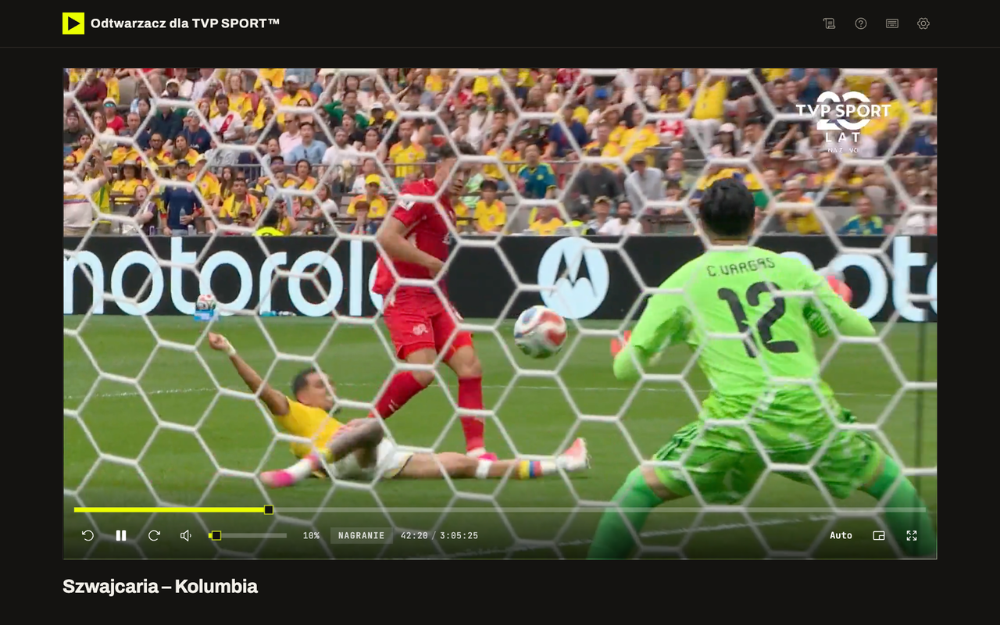
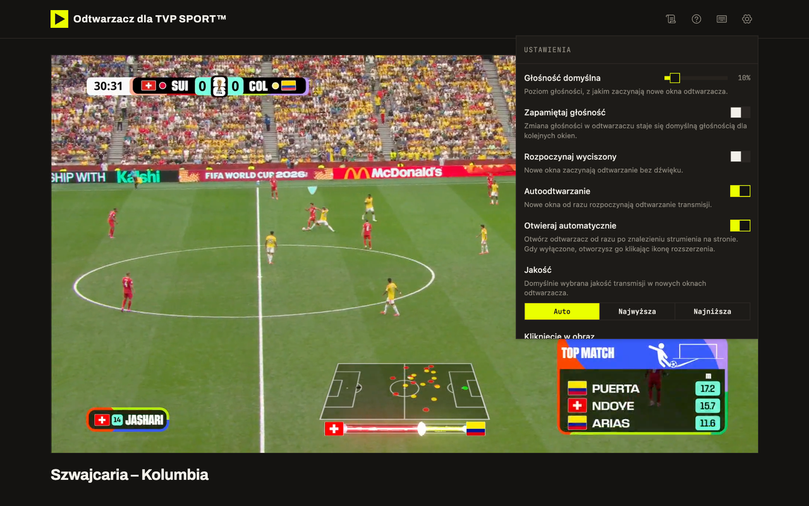
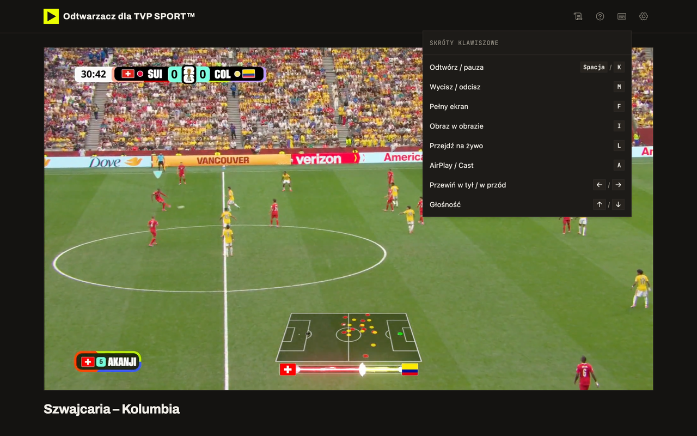

# Odtwarzacz dla TVP SPORT™

[](https://chromewebstore.google.com/detail/odtwarzacz-dla-tvp-sport/nkkeeakhllmffaanpmlpefpfagbeihma)
[](https://chromewebstore.google.com/detail/odtwarzacz-dla-tvp-sport/nkkeeakhllmffaanpmlpefpfagbeihma)
[](https://chromewebstore.google.com/detail/odtwarzacz-dla-tvp-sport/nkkeeakhllmffaanpmlpefpfagbeihma)
[](https://addons.mozilla.org/pl/firefox/addon/odtwarzacz-dla-tvp-sport/)
[](https://addons.mozilla.org/pl/firefox/addon/odtwarzacz-dla-tvp-sport/)
[](https://addons.mozilla.org/pl/firefox/addon/odtwarzacz-dla-tvp-sport/)
[](LICENSE)

Nieoficjalne rozszerzenie przeglądarki, które pozwala oglądać transmisje ze [sport.tvp.pl](https://sport.tvp.pl) w wygodniejszym, bardziej funkcjonalnym odtwarzaczu.

**Pobierz**: [Chrome Web Store](https://chromewebstore.google.com/detail/odtwarzacz-dla-tvp-sport/nkkeeakhllmffaanpmlpefpfagbeihma) · [Firefox Add-ons](https://addons.mozilla.org/pl/firefox/addon/odtwarzacz-dla-tvp-sport/)



## Dlaczego powstało

Domyślny odtwarzacz TVP SPORT ma ograniczone możliwości.
Rozszerzenie automatycznie wykrywa strumień transmisji i otwiera go w nowym odtwarzaczu, który daje pełną kontrolę nad oglądaniem.

## Funkcje

- **Wybór jakości obrazu** (ręczny lub automatyczny) z możliwością ustawienia domyślnej jakości
- **Wybór ścieżki dźwiękowej i napisów**, np. komentarza w języku angielskim
- **Skróty klawiszowe** do odtwarzania, pauzy, wyciszania, przewijania, regulacji głośności i przełączania pełnego ekranu
- **Tryb obraz w obrazie** (Picture in Picture) oraz przesyłanie obrazu na kompatybilne urządzenia (Google Cast)
- **Przewijanie nagrań** z możliwością ustawienia długości skoku
- **Zapamiętywanie wybranych ustawień**
- **Jasny i ciemny motyw** oraz możliwość dodania własnych stylów

| Ustawienia | Skróty klawiszowe |
| --- | --- |
|  |  |

## Instalacja

- **Chrome / Edge / Brave / Opera / Vivaldi**: zainstaluj z [Chrome Web Store](https://chromewebstore.google.com/detail/odtwarzacz-dla-tvp-sport/nkkeeakhllmffaanpmlpefpfagbeihma)
- **Firefox / LibreWolf / Zen**: zainstaluj z [Firefox Add-ons](https://addons.mozilla.org/pl/firefox/addon/odtwarzacz-dla-tvp-sport/)

Po zainstalowaniu rozszerzenia wystarczy otworzyć wybraną transmisję na sport.tvp.pl i rozpocząć odtwarzanie. Reszta dzieje się automatycznie.

### Instalacja ręczna

1. Zbuduj rozszerzenie (poniżej) albo pobierz paczkę z [wydań](https://github.com/damian-kociszewski/tvp-sport-player/releases).
2. **Chrome / Edge / Brave / Opera / Vivaldi**: `chrome://extensions` → włącz "Tryb dewelopera" → "Załaduj rozpakowane" → wskaż katalog `dist/chromium`.
3. **Firefox / LibreWolf / Zen**: `about:debugging#/runtime/this-firefox` → "Załaduj tymczasowy dodatek" → wskaż `dist/gecko/manifest.json`. Następnie w `about:addons` nadaj rozszerzeniu uprawnienia do witryn tvp.pl i redcdn.pl.

## Rozwój

```bash
npm install
npm run dev            # tryb deweloperski (Chromium)
npm run build          # build obu wersji: dist/chromium/ i dist/gecko/
npm run build:chromium # tylko Chromium
npm run build:gecko    # tylko Firefox
```

### Aktualizacja bibliotek Google Cast

Pliki w `public/vendor/` to lokalne, niezmodyfikowane kopie Google Cast SDK.

```bash
curl -sf "https://www.gstatic.com/eureka/clank/cast_sender.js" -o public/vendor/cast_sender.js
curl -sf "https://www.gstatic.com/cast/sdk/libs/sender/1.0/cast_framework.js" -o public/vendor/cast_framework.js
```

### Zdalne adresy skryptów

Sklepy z rozszerzeniami wymagają, żeby cały kod znajdował się w paczce.
Vidstack ma adresy zdalne wpisane na sztywno, więc usuwa je łatka z katalogu `patches/` ([patch-package](https://github.com/ds300/patch-package)).
Build dodatkowo sprawdza gotową paczkę pod kątem zewnętrznych adresów.

## Prywatność

Rozszerzenie nie zbiera ani nie wysyła żadnych danych. Wszystkie operacje wykonywane są lokalnie w przeglądarce, a transmisje są odtwarzane bezpośrednio z serwerów TVP. Szczegóły: [Polityka prywatności](PRIVACY.md).

## Licencja

[MIT](LICENSE)

Rozszerzenie nie jest powiązane, sponsorowane ani autoryzowane przez Telewizję Polską S.A. Nazwa "TVP SPORT", logo oraz treść transmisji są własnością ich właścicieli.
